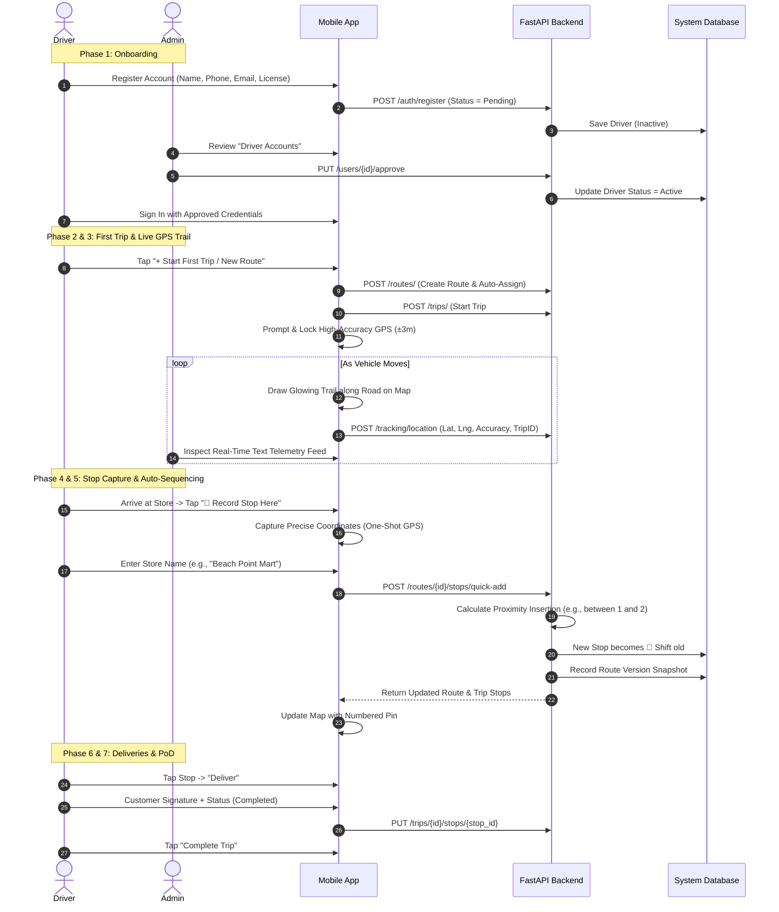

# RouteOS — Distribution Intelligence System
## Complete Operational & Working Process Manual

---

## 1. Overview & System Philosophy

**RouteOS** is an intelligent logistics and distribution management system designed specifically for local distribution businesses (such as FMCG, retail goods, and beverage distribution in regions like Kozhikode, Kerala).

Unlike traditional rigid logistics software where routes must be painstakingly planned on desktop computers before drivers hit the road, **RouteOS is built field-first**:
* **The driver builds the route dynamically during their first trip.**
* **The phone’s physical GPS accurately maps stops as deliveries happen.**
* **The app intelligently auto-sequences stops** along the driving path.
* **The admin monitors live operations in real-time** via a streamlined, text-based GPS telemetry feed.

---

## 2. Core Roles

| Role | Primary Environment | Core Responsibility |
|---|---|---|
| **Driver** | Android Mobile App (Dark HUD Interface) | Creates routes, records stops using phone GPS, follows delivery paths, and collects Proof-of-Delivery. |
| **Admin** | Management Dashboard (Web / Tablet / Phone) | Approves driver accounts, oversees text-based live GPS tracking feeds, inspects route modifications, and reviews performance analytics. |

---

## 3. End-to-End Working Process



---

## 4. Detailed Stage-by-Stage Workflow

### Phase 1: Driver Registration & Admin Approval Gate
1. **Driver Self-Registration**:
   - A new driver opens the app and clicks **"Register as Driver"**.
   - They provide their Full Name, Phone Number, Email, Password, and Vehicle Plate / License Number.
   - The account is registered with state **`PENDING`**. The driver cannot log in until verified.
2. **Admin Verification**:
   - The business administrator logs into the system and navigates to **Driver Accounts**.
   - The admin sees pending driver requests with their registration timestamp and credentials.
   - The admin taps **"Approve"**.
   - The driver’s account immediately transitions to **`ACTIVE`**, enabling them to sign in.

---

### Phase 2: The "First Trip" Route Creation
*In traditional software, routes are pre-drawn by managers. In RouteOS, the first real delivery run forms the baseline route.*

1. **Creating the Route**:
   - After signing in, the driver taps **`+ Start First Trip / New Route`**.
   - The driver enters a route name (e.g., *“Calicut Beach — Mavoor Road Corridor”*) and starting depot/area.
2. **Instant Trip Kick-off**:
   - The system automatically creates the route, assigns it to the driver, and launches an active trip with **zero stops**.
   - The phone requests **High-Accuracy GPS Permissions** (`LocationAccuracy.bestForNavigation`).

---

### Phase 3: Real-Time GPS Tracking & Progressive Path Drawing
1. **Background GPS Stream**:
   - While driving, the phone samples GPS coordinates continuously (every 3 meters).
   - Every 8–10 seconds, these coordinates are sent to the backend (`POST /tracking/location`).
2. **Live Map Trail**:
   - Inside the driver app's Map tab, the path gradually appears behind the vehicle as a **neon trail**.
   - A pulsing navigation icon indicates the driver’s current position with a live accuracy meter (e.g. `GPS Active (±3.2m)`).

---

### Phase 4: Arrival & Precision GPS Stop Capture
When the driver arrives at a customer, shop, or retail destination:

1. **Tap "Record Stop Here (GPS)"**:
   - The driver stops the vehicle at the delivery point and taps the floating action button.
2. **One-Shot Hardware Capture**:
   - The phone queries the GPS hardware for an instantaneous, high-precision reading (`LocationAccuracy.bestForNavigation`).
   - A bottom sheet appears displaying the captured coordinates (e.g., `11.25881, 75.78042`) and the satellite margin of error (e.g., `±2.8m`).
3. **Stop Identification**:
   - The driver types the store name (e.g., *“Kozhikode Central Store”*) and optional delivery notes (e.g., *“Unload at side gate”*).

---

### Phase 5: Dynamic Proximity Insertion & Auto-Sequencing
*This is the core algorithmic intelligence of RouteOS.*

When a new stop is added:
1. **Proximity Calculation**:
   - The backend checks where this physical location lies along the path.
2. **Automatic Number Shifting**:
   - If the new location is situated **between Stop #1 and Stop #2**, the algorithm automatically inserts the new stop as **Stop #2**.
   - The former Stop #2 is automatically bumped to **Stop #3**.
   - Subsequent stops (#3, #4, etc.) are shifted down accordingly (`sequence + 1`).
3. **Instant Sync**:
   - The route and the active trip are updated simultaneously.
   - The map re-draws immediately, and the stops list updates with the new sequential ordering.
4. **Version History Snapshot**:
   - Every insertion creates an immutable snapshot of the route version (`v1`, `v2`, `v3`...), documenting who added the stop and when.

---

### Phase 6: Delivery Execution & Proof-of-Delivery (PoD)
On subsequent daily trips (or later during the same run):
1. **Navigation**:
   - Drivers tap the navigation icon on any stop card to launch Google Maps directly to the customer's coordinates.
2. **Delivery Confirmation**:
   - Upon handing over goods, the driver taps **"Deliver"**.
   - The app opens the Proof-of-Delivery sheet:
     - **Digital Signature**: The recipient signs directly on the phone screen.
     - **Delivery Status**: Choose between *Delivered*, *Partial Delivery*, *Payment Pending*, or *Rescheduled*.
     - **Notes**: Enter cash collected, remarks, or package counts.
3. **Trip Progress Tracker**:
   - A progress bar updates in real time (e.g., `8 of 14 stops done (57%)`).

---

### Phase 7: Admin Operations & Live Monitoring
*The admin interface is deliberately kept clean, fast, and text-based.*

1. **Text-Based Live GPS Feed**:
   - Admins open the **Live Tracking** console.
   - Rather than relying on heavy, slow-loading map widgets, the console displays a high-speed telemetry feed:
     - Driver Name & Vehicle Plate
     - Active Route & Trip ID
     - Exact Latitude & Longitude (formatted in monospace font)
     - Sat-fix accuracy (in meters)
     - Last check-in timestamp (e.g., `3s ago`)
   - The feed auto-refreshes every 10 seconds with radar pulse animations.
2. **Route Modification Approvals**:
   - If stops were inserted or re-ordered, the admin can review the changes in the **Route Audit** tab and approve or rollback changes.

---

### Phase 8: Trip Wrap-Up & Return to Depot
1. When all stops are completed, the driver taps **"Complete Trip"**.
2. The trip status shifts to **`COMPLETED`** with an end timestamp.
3. Total delivery time, completed stops count, and compliance rate are recorded for business analytics.

---

## 5. Field Edge Cases & Reliability Design

| Situation | System Behavior |
|---|---|
| **Temporary Cellular Disconnection** | The app caches delivery signatures and GPS records locally. Once signal returns, updates push to the backend without data loss. |
| **GPS Jitter in High-Density Areas** | The app applies distance and accuracy filters (`distanceFilter: 3m`, accuracy checks) so GPS drift does not create duplicate stops. |
| **Driver Adds Stop at Wrong Location** | Stops can be re-sequenced or marked inactive by either the driver or admin from the Route Details screen. |
| **Network IP Changes on Local Servers** | The app includes an automated USB port-forwarding bridge (`adb reverse`) and an in-app **Server Connection Manager** on the login screen to switch IPs in 1 tap without editing code. |

---

## 6. Visual Screen-by-Screen UI Flow

Below are direct visual representations of each core screen in the operational cycle:

```
  ┌─────────────────────────────────────────────────────────────────────────────┐
  │                           OPERATIONAL SCREEN FLOW                           │
  │                                                                             │
  │  [1. Register] ──> [2. Admin Approval] ──> [3. Login Screen (Live Ping)]    │
  │                                                        │                    │
  │                                                        ▼                    │
  │  [6. Active GPS Map] <── [5. Create Route] <── [4. Driver Dashboard]        │
  │         │                                                                   │
  │         ▼                                                                   │
  │  [7. GPS Stop Capture] ──> [8. Auto-Sequenced Stops] ──> [9. PoD Signature] │
  │                                                                │            │
  │                                                                ▼            │
  │                                                    [10. Admin Telemetry]    │
  └─────────────────────────────────────────────────────────────────────────────┘
```

---

### Screen 1: Driver Login with Live Heartbeat Pill
*The login portal featuring animated neon gradients and a real-time server health indicator.*

```
┌──────────────────────────────────────────────────────────────┐
│  RouteOS                                   [● localhost:8000]│ <-- Tap to ping/switch
├──────────────────────────────────────────────────────────────┤
│                                                              │
│                      [ ⬡ RouteOS ]                           │
│                                                              │
│                        RouteOS                               │
│            Distribution Intelligence System                  │
│                                                              │
│      ┌────────────────────────────────────────────────┐      │
│      │ Welcome back                                   │      │
│      │ Sign in to your account                        │      │
│      │                                                │      │
│      │ [ Email Address                              ] │      │
│      │ [ driver@route.com                           ] │      │
│      │                                                │      │
│      │ [ Password                                   ] │      │
│      │ [ ••••••••••••••                           👁 ] │      │
│      │                                                │      │
│      │ ┌────────────────────────────────────────────┐ │      │
│      │ │             ⚡ SIGN IN                     │ │      │
│      │ └────────────────────────────────────────────┘ │      │
│      └────────────────────────────────────────────────┘      │
│                                                              │
│                 New driver? Register here                    │
│                     📍 Kozhikode, Kerala                     │
└──────────────────────────────────────────────────────────────┘
```

---

### Screen 2: Driver Self-Registration
*Drivers submit their credentials and vehicle details. Upon submission, the app locks to `PENDING`.*

```
┌──────────────────────────────────────────────────────────────┐
│  ← Back                                                      │
├──────────────────────────────────────────────────────────────┤
│                                                              │
│  Join Fleet                                                  │
│  Driver Registration                                         │
│                                                              │
│  ┌─ STATUS NOTICE ─────────────────────────────────────────┐ │
│  │ ⏳ New registrations require Admin approval             │ │
│  │    before you can sign in and start deliveries.         │ │
│  └─────────────────────────────────────────────────────────┘ │
│                                                              │
│  [ Full Name                ] (e.g. Rahul Nair)              │
│  [ Phone Number             ] (e.g. +91 98765 43210)         │
│  [ Email Address            ] (e.g. rahul@route.com)         │
│  [ Password                 ]                                │
│  [ Vehicle / Plate Number   ] (e.g. KL-11-BH-4210)           │
│                                                              │
│  ┌─────────────────────────────────────────────────────────┐ │
│  │               SUBMIT APPLICATION                        │ │
│  └─────────────────────────────────────────────────────────┘ │
└──────────────────────────────────────────────────────────────┘
```

---

### Screen 3: Admin Driver Approval Screen
*The business owner reviews pending applications and activates verified drivers with 1 tap.*

```
┌──────────────────────────────────────────────────────────────┐
│  Driver Accounts                                             │
├──────────────────────────────────────────────────────────────┤
│   [ PENDING (1) ]                      [ ACTIVE (4) ]        │
├──────────────────────────────────────────────────────────────┤
│                                                              │
│  ┌────────────────────────────────────────────────────────┐  │
│  │ 👤 Rahul Nair                          [PENDING VERIF] │  │
│  │ 📞 +91 98765 43210                                     │  │
│  │ ✉️ rahul@route.com                                      │  │
│  │ 🚚 Vehicle: KL-11-BH-4210                              │  │
│  │ ⏱ Registered: Today, 10:45 AM                          │  │
│  │                                                        │  │
│  │  [ ✕ Reject ]                       [ ✓ APPROVE ]     │  │
│  └────────────────────────────────────────────────────────┘  │
│                                                              │
└──────────────────────────────────────────────────────────────┘
```

---

### Screen 4: Driver Dashboard & GPS Prompt
*The hub for drivers. If location is off, a high-priority warning card is displayed.*

```
┌──────────────────────────────────────────────────────────────┐
│  My Routes                                      👤   ⎋ Logout│
├──────────────────────────────────────────────────────────────┤
│                                                              │
│  ┌─ ⚠️ GPS PERMISSION NEEDED ──────────────────────────────┐ │
│  │ 📍 High-accuracy location access is required to draw    │ │
│  │    your route and record stops.                         │ │
│  │                                            [ ENABLE ]   │ │
│  └─────────────────────────────────────────────────────────┘ │
│                                                              │
│  Hello, Rahul Nair                                           │
│  Record your delivery stops or continue an assigned route.   │
│                                                              │
│  ┌─ 🚀 FIRST TRIP / NEW ROUTE ─────────────────────────────┐ │
│  │ 🛣️ Drive with GPS active to auto-draw the route         │ │
│  │    and capture store locations on the road.             │ │
│  │                                            [ + START ]  │ │
│  └─────────────────────────────────────────────────────────┘ │
│                                                              │
│  My Assigned Routes                                          │
│  ┌────────────────────────────────────────────────────────┐  │
│  │ [MAP PREVIEW] Calicut South FMCG Run                   │  │
│  │ 🏪 12 stops  •  🗓️ Mon, Wed, Fri                       │  │
│  │                                          [ START TRIP ]│  │
│  └────────────────────────────────────────────────────────┘  │
│                                                              │
│                                           [ + New Route ] ◄── FAB
└──────────────────────────────────────────────────────────────┘
```

---

### Screen 5: "Start First Trip" Route Creator
*Driver creates their route on day one right from the road.*

```
┌──────────────────────────────────────────────────────────────┐
│  ┌────────────────────────────────────────────────────────┐  │
│  │ 🛣️ Start First Trip / New Route                     ✕ │  │
│  │ Create a route and activate GPS to draw your path.     │  │
│  │                                                        │  │
│  │ Route Name                                             │  │
│  │ [ Kozhikode Beach — Mavoor Rd Run                    ] │  │
│  │                                                        │  │
│  │ Area / Zone                                            │  │
│  │ [ Kozhikode South                                    ] │  │
│  │                                                        │  │
│  │ Start Depot / Landmark                                 │  │
│  │ [ Beach Road Main Warehouse                          ] │  │
│  │                                                        │  │
│  │ ┌────────────────────────────────────────────────────┐ │  │
│  │ │      🚀 CREATE ROUTE & START FIRST TRIP            │ │  │
│  │ └────────────────────────────────────────────────────┘ │  │
│  └────────────────────────────────────────────────────────┘  │
└──────────────────────────────────────────────────────────────┘
```

---

### Screen 6: Active Trip — Live Map & Auto-Drawing Route
*As the driver moves, the route polyline path is drawn continuously in real-time.*

```
┌──────────────────────────────────────────────────────────────┐
│  Trip: Kozhikode Beach Run                        ✓ Complete │
│  [  Stops (0)  ]                  [  Map (LIVE)  ]           │
├──────────────────────────────────────────────────────────────┤
│                                                              │
│   [● GPS Active (±2.8m)]                                     │
│                                                              │
│          ═════════════════════╗ (Road)                       │
│                               ║                              │
│                               ║  ▲ (Pulsing Vehicle Marker)  │
│                               ║ ╱                            │
│                               ║╱ (Glowing Neon Trail Drawn   │
│                               ●   Progressively as Car Moves)│
│                               │                              │
│                               │                              │
│                        [ 🏢 Depot ]                          │
│                                                              │
│                                                              │
│                                                              │
│                                                              │
│                            ┌───────────────────────────────┐ │
│                            │ 📍 RECORD STOP HERE (GPS)     │ │ ◄── Tapped on arrival
│                            └───────────────────────────────┘ │
└──────────────────────────────────────────────────────────────┘
```

---

### Screen 7: Physical Stop Capture Modal
*Driver arrives at a shop and locks the coordinates with satellite precision.*

```
┌──────────────────────────────────────────────────────────────┐
│  ┌────────────────────────────────────────────────────────┐  │
│  │ 📍 Record Stop at Current GPS                       ✕ │  │
│  │                                                        │  │
│  │ ┌─ GPS ACCURACY LOCKED ──────────────────────────────┐ │  │
│  │ │ 📡 11.25881, 75.78042  (±2.8m)     [HIGH ACCURACY] │ │  │
│  │ └────────────────────────────────────────────────────┘ │  │
│  │                                                        │  │
│  │ Store / Customer Name *                                │  │
│  │ [ Beach Point Supermarket                            ] │  │
│  │                                                        │  │
│  │ Address / Landmark                                     │  │
│  │ [ Near Beach Hotel, Mavoor Rd Junction               ] │  │
│  │                                                        │  │
│  │ Delivery Remarks (Optional)                            │  │
│  │ [ Unload crates at rear door                         ] │  │
│  │                                                        │  │
│  │ ┌────────────────────────────────────────────────────┐ │  │
│  │ │         💾 SAVE & AUTO-INSERT STOP                 │ │  │
│  │ └────────────────────────────────────────────────────┘ │  │
│  └────────────────────────────────────────────────────────┘  │
└──────────────────────────────────────────────────────────────┘
```

---

### Screen 8: Stops List with Dynamic Auto-Sequencing
*If a stop was inserted between Stop 1 and 2, it becomes Stop #2, automatically shifting former Stop 2 to Stop #3.*

```
┌──────────────────────────────────────────────────────────────┐
│  Trip: Kozhikode Beach Run                        ✓ Complete │
│  [  Stops (3)  ]                  [  Map  ]                  │
├──────────────────────────────────────────────────────────────┤
│  0 of 3 stops completed (0%)                   [Next: Stop #1]│
│  ═══════════════════════════════════════════════════════════ │
│                                                              │
│  ┌────────────────────────────────────────────────────────┐  │
│  │ ➊ Warehouse Depot                     [ ↗ Navigate ]   │  │
│  │   Beach Road Main Warehouse                            │  │
│  │                                        [ Deliver ]     │  │
│  └────────────────────────────────────────────────────────┘  │
│                                                              │
│  ┌────────────────────────────────────────────────────────┐  │
│  │ ➋ Beach Point Supermarket             [ ↗ Navigate ]   │ ◄── Newly Inserted
│  │   Near Beach Hotel Junction (GPS Added)                │     Auto-shifted to #2
│  │                                        [ Deliver ]     │  │
│  └────────────────────────────────────────────────────────┘  │
│                                                              │
│  ┌────────────────────────────────────────────────────────┐  │
│  │ ➌ Mavoor Road Retail Mart             [ ↗ Navigate ]   │ ◄── Automatically
│  │   Opposite Bus Stand                                   │     Bumped from #2 to #3
│  │                                        [ Deliver ]     │  │
│  └────────────────────────────────────────────────────────┘  │
│                                                              │
│                            ┌───────────────────────────────┐ │
│                            │ 📍 RECORD STOP HERE (GPS)     │ │
│                            └───────────────────────────────┘ │
└──────────────────────────────────────────────────────────────┘
```

---

### Screen 9: Proof-of-Delivery (PoD) Sheet
*Upon delivering goods, customer signs on glass and delivery state is saved.*

```
┌──────────────────────────────────────────────────────────────┐
│  ┌────────────────────────────────────────────────────────┐  │
│  │ Proof of Delivery — Beach Point Supermarket         ✕ │  │
│  │                                                        │  │
│  │ Delivery Status:                                       │  │
│  │ [✓ Delivered]  [Partial]  [Payment Pending]  [Skipped] │  │
│  │                                                        │  │
│  │ Customer Signature:                                    │  │
│  │ ┌────────────────────────────────────────────────────┐ │  │
│  │ │                                                    │ │  │
│  │ │               ✍️  Rahul Verma                      │ │  │
│  │ │                                                    │ │  │
│  │ └────────────────────────────────────────────────────┘ │  │
│  │ [ Clear Signature ]                                    │  │
│  │                                                        │  │
│  │ Packages / Payment Notes:                              │  │
│  │ [ 15 Crates delivered. Cash received: ₹4,500.        ] │  │
│  │                                                        │  │
│  │ ┌────────────────────────────────────────────────────┐ │  │
│  │ │               CONFIRM DELIVERY                     │ │  │
│  │ └────────────────────────────────────────────────────┘ │  │
│  └────────────────────────────────────────────────────────┘  │
└──────────────────────────────────────────────────────────────┘
```

---

### Screen 10: Admin Live Text-Based Telemetry Radar
*Ultra-fast, distraction-free command console for administrators.*

```
┌──────────────────────────────────────────────────────────────┐
│  Live Tracking Console                        [● LIVE (10s)] │
├──────────────────────────────────────────────────────────────┤
│  RADAR TELEMETRY FEED                         Active Fleet: 3 │
├──────────────────────────────────────────────────────────────┤
│                                                              │
│  ┌────────────────────────────────────────────────────────┐  │
│  │ 🟢 RAHUL NAIR  •  KL-11-BH-4210                        │  │
│  │ Route: Kozhikode Beach Run (Trip #14)                  │  │
│  │ LAT: 11.258812    LNG: 75.780419    ACCURACY: ±2.8m    │  │
│  │ Speed: 28 km/h    Heading: NW       Checked in: 2s ago │  │
│  │ Status: En route to Stop #3 (Mavoor Rd)                │  │
│  └────────────────────────────────────────────────────────┘  │
│                                                              │
│  ┌────────────────────────────────────────────────────────┐  │
│  │ 🟢 ANAS ALI    •  KL-11-CA-9081                        │  │
│  │ Route: Feroke Industrial Circle (Trip #12)             │  │
│  │ LAT: 11.192041    LNG: 75.834190    ACCURACY: ±3.5m    │  │
│  │ Speed: 0 km/h     Heading: S        Checked in: 6s ago │  │
│  │ Status: Delivering at Stop #7 (Mampuzha Traders)       │  │
│  └────────────────────────────────────────────────────────┘  │
│                                                              │
│  ┌────────────────────────────────────────────────────────┐  │
│  │ 🟡 DILEEP K    •  KL-11-AA-1122                        │  │
│  │ Route: Beypore Coastal Line (Trip #15)                 │  │
│  │ LAT: 11.164302    LNG: 75.808914    ACCURACY: ±4.1m    │  │
│  │ Speed: 14 km/h    Heading: NE       Checked in: 9s ago │  │
│  │ Status: Returning to Depot                             │  │
│  └────────────────────────────────────────────────────────┘  │
│                                                              │
└──────────────────────────────────────────────────────────────┘
```

